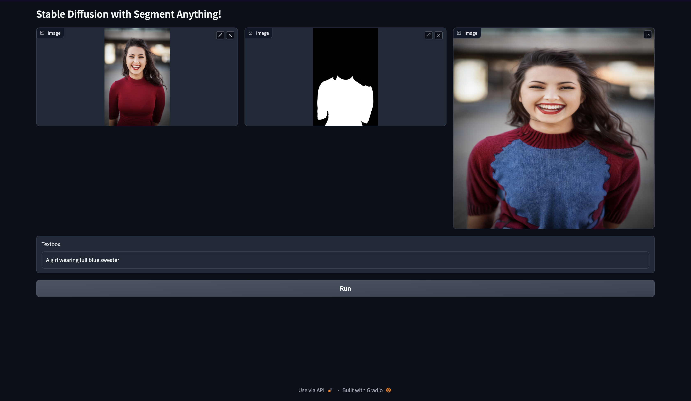

# Stable Diffusion with Segment Anything Model

## How to run?
```
git clone https://github.com/aneesh-aparajit/stable-diffusion-with-sam.git
python3 -m venv venv
source venv/bin/activate
cd stable-diffusion-with-sam/
pip install -r requirements.txt
python3 app.py
```

- To get the mask, we need to click on some part of the image for which you want to mask. If you didn't get the mask as expected, click at different locations, because Segment Anything Model works conditioned on the points of interests.

## Output


